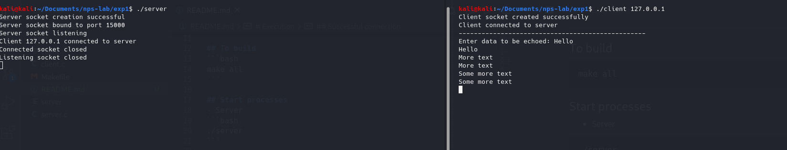
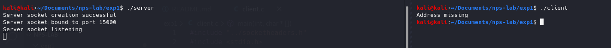
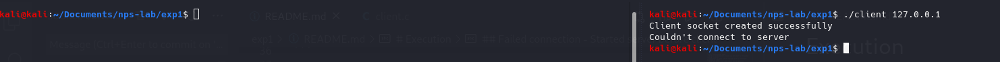

<!-- omit in toc -->
# Experiment 1
Implement a client and server communication using sockets programming.

<!-- omit in toc -->
# Table of contents
- [Description](#description)
- [Execution](#execution)
  - [To build](#to-build)
  - [Start processes](#start-processes)
  - [To clean executables](#to-clean-executables)
- [Execution](#execution-1)
  - [Successful connection](#successful-connection)
  - [Failed connection - Missing address](#failed-connection---missing-address)
  - [Failed connection - Started server before client](#failed-connection---started-server-before-client)

# Description
- Basic client-server model.
- Server is an echoserver, echoes all data back to the client sending the data.
- Client asks for data, which is echoed back to itself and displayed on stdout.
- Concurrent server, multiple clients can be opened and serviced at the same time.

# Execution

## To build
```bash
make all
```

## Start processes
- Server
```bash
./server
```

- Client (in general)
```bash
./client <ip-address>
```
- Client (on localhost)
```bash
./client 127.0.0.1
```


## To clean executables
```bash
make clean
```

# Execution

## Successful connection


## Failed connection - Missing address


## Failed connection - Started server before client
