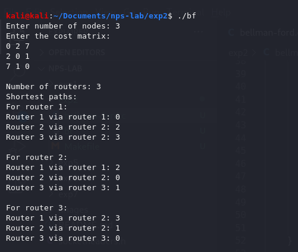

<!-- omit in toc -->
# Experiment 2
Write a program to implement distance vector routing protocol for a simple topology of routers.

<!-- omit in toc -->
# Table of contents
- [Description](#description)
- [Initiation](#initiation)
  - [To build](#to-build)
  - [Start processes](#start-processes)
  - [To clean executables](#to-clean-executables)
- [Execution](#execution)
  - [Successful execution](#successful-execution)

# Description
- Given a count of routers and the weights of their connections, displays a shortest distance for each router to every other router through it's predecessor.
- Distance Vector Routing implemented using the Bellman-Ford Algorithm.

# Initiation

## To build
```bash
make all
```

## Start processes
- Execute
```bash
./bf
```

## To clean executables
```bash
make clean
```

# Execution

## Successful execution
