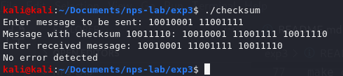
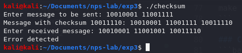
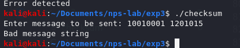
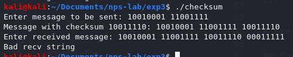
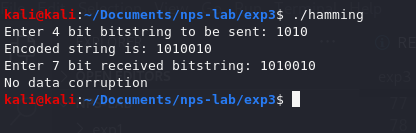
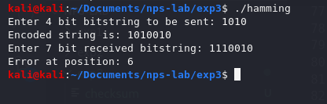
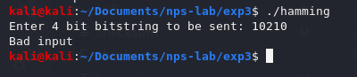
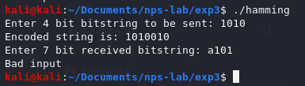

<!-- omit in toc -->
# Experiment 3
Write a program to implement error detection and Correction concept using Checksum and Hamming code.

<!-- omit in toc -->
# Table of contents
- [Description](#description)
- [Initiation](#initiation)
  - [To build](#to-build)
    - [All](#all)
    - [Hamming code](#hamming-code)
    - [Checksum](#checksum)
  - [Start processes](#start-processes)
    - [Execute hamming code](#execute-hamming-code)
    - [Execute checksum](#execute-checksum)
  - [To clean executables](#to-clean-executables)
    - [All executables](#all-executables)
    - [Hamming code](#hamming-code-1)
    - [Checksum](#checksum-1)
- [Execution](#execution)
  - [Checksum](#checksum-2)
    - [Successful execution - Error free receival](#successful-execution---error-free-receival)
    - [Successful execution - Received with error](#successful-execution---received-with-error)
    - [Failed execution - Bad message string](#failed-execution---bad-message-string)
    - [Failed execution - Bad received string](#failed-execution---bad-received-string)
  - [Hamming code](#hamming-code-2)
    - [Successful execution - Error free receival](#successful-execution---error-free-receival-1)
    - [Successful execution - Received with error](#successful-execution---received-with-error-1)
    - [Failed execution - Bad message string](#failed-execution---bad-message-string-1)
    - [Failed execution - Bad received string](#failed-execution---bad-received-string-1)

# Description
- Verify if given message and the recieved message are error-free using the concept of a checksum.
- Detect the position of error (if it exists) in given message and the recieved message using the Hamming code.
- Both are simulations, which means only the concepts are tested out, not via actual transmission of messages but by supplying both sent and received messages.

# Initiation

## To build

### All
```bash
make all
```

### Hamming code
```bash
make hamming
```

### Checksum
```bash
make checksum
```

## Start processes

### Execute hamming code
```bash
./hamming
```

### Execute checksum
```bash
./checksum
```

## To clean executables

### All executables
```bash
make clean-all
```

### Hamming code
```bash
make clean-hamming
```

### Checksum
```bash
make clean-checksum
```

# Execution

## Checksum

### Successful execution - Error free receival


### Successful execution - Received with error


### Failed execution - Bad message string


### Failed execution - Bad received string



## Hamming code

### Successful execution - Error free receival


### Successful execution - Received with error


### Failed execution - Bad message string


### Failed execution - Bad received string
