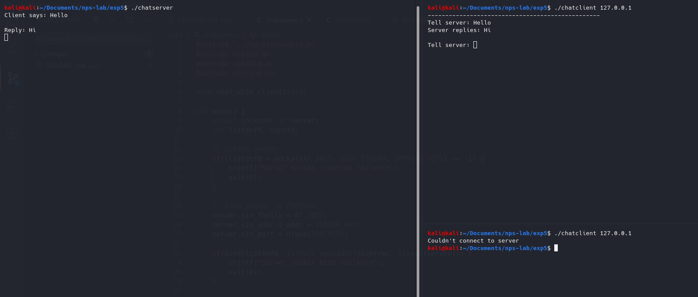

<!-- omit in toc -->
# Experiment 5
Write a program to implement concurrent chat server that allows a client to chat with the server.

<!-- omit in toc -->
# Table of contents
- [Description](#description)
- [Initiation](#initiation)
  - [To build](#to-build)
  - [Start processes](#start-processes)
  - [To clean executables](#to-clean-executables)
- [Execution](#execution)
  - [Successful communication](#successful-communication)
  - [Failed connection - Multiple clients](#failed-connection---multiple-clients)
  - [Failed connection - Missing address](#failed-connection---missing-address)

# Description
- TCP iterative client-server model.
- Server is a chatserver, communicates independently with the client connected.
- Doesn't support multiple clients at the same time.
- Hence, clients cannot communicate with each other, as there can only be one client at a time.
- Client is prompted for input, to be sent to the server.
- Server recieves client input, displays it and sends a response back to the client.
- Client recieves server reply, and process continues.

# Initiation

## To build
```bash
make all
```

## Start processes
- Server
```bash
./chatserver
```
- Client
```bash
./chatclient 127.0.0.1
```

## To clean executables
```bash
make clean
```

# Execution

## Successful communication


## Failed connection - Multiple clients


## Failed connection - Missing address
