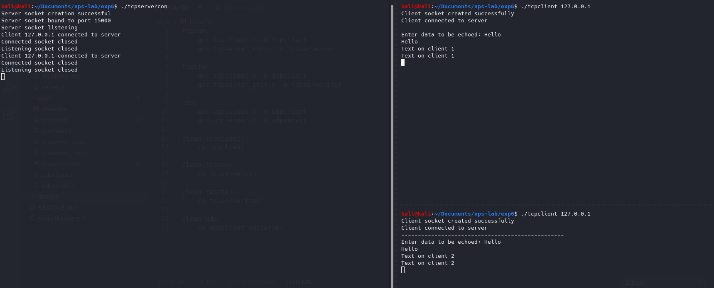
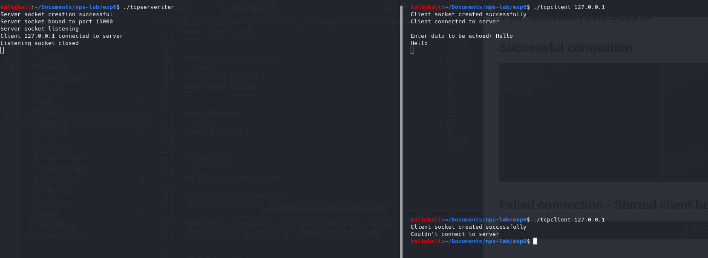
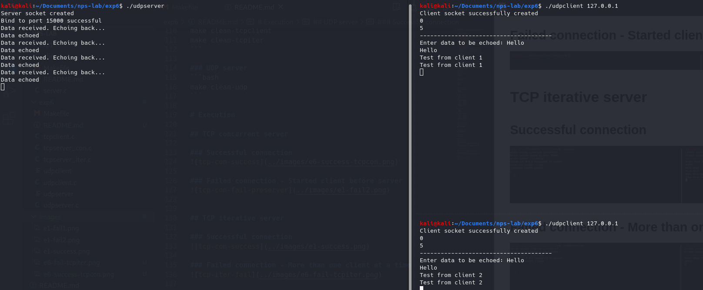
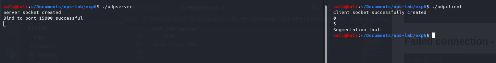

<!-- omit in toc -->
# Experiment 6
Implementation of concurrent and iterative echo server using both connection and connectionless socket system calls.

<!-- omit in toc -->
# Table of contents
- [Description](#description)
- [Execution](#execution)
  - [To build](#to-build)
    - [TCP concurrent server](#tcp-concurrent-server)
    - [TCP iterative server](#tcp-iterative-server)
    - [UDP server](#udp-server)
  - [Start processes](#start-processes)
    - [TCP concurrent server](#tcp-concurrent-server-1)
    - [TCP iterative server](#tcp-iterative-server-1)
    - [TCP client](#tcp-client)
    - [UDP server](#udp-server-1)
  - [To clean executables](#to-clean-executables)
    - [TCP concurrent server](#tcp-concurrent-server-2)
    - [TCP iterative server](#tcp-iterative-server-2)
    - [UDP server](#udp-server-2)
- [Execution](#execution-1)
  - [TCP concurrent server](#tcp-concurrent-server-3)
    - [Successful connection](#successful-connection)
    - [Failed connection - Started client before server](#failed-connection---started-client-before-server)
  - [TCP iterative server](#tcp-iterative-server-3)
    - [Successful connection](#successful-connection-1)
    - [Failed connection - More than one client at a time](#failed-connection---more-than-one-client-at-a-time)
  - [UDP server](#udp-server-3)
    - [Successful connection](#successful-connection-2)
    - [Failed connection - Missing address](#failed-connection---missing-address)

# Description
- Basic client-server model for both connection-oriented (TCP) and connectionless protocols (UDP).
- Server is an echoserver, echoes all data back to the client sending the data.
- Client asks for data, which is echoed back to itself and displayed on stdout.
- For the TCP servers, both concurrent and iterative servers are set up
  - For the conncurrent server, multiple clients can be serviced by the server simultaneously.
  - For the iterative server, only one client can be serviced at a time. If another client tries to connect to the server, it shall be rejected.

# Execution

## To build

### TCP concurrent server
```bash
make tcpcon
```

### TCP iterative server
```bash
make tcpiter
```

### UDP server
```bash
make udp
```


## Start processes

### TCP concurrent server
- Server
```bash
./tcpservercon
```

### TCP iterative server
- Server
```bash
./tcpserveriter
```

### TCP client
- Client (in general)
```bash
./tcpclient <ip-address>
```
- Client (on localhost)
```bash
./tcpclient 127.0.0.1
```

### UDP server
- Server
```bash
./udpserver
```

- Client (in general)
```bash
./udpclient <ip-address>
```
- Client (on localhost)
```bash
./udpclient 127.0.0.1
```


## To clean executables

### TCP concurrent server
```bash
make clean-tcpclient
make clean-tcpcon
```

### TCP iterative server
```bash
make clean-tcpclient
make clean-tcpiter
```

### UDP server
```bash
make clean-udp
```

# Execution

## TCP concurrent server

### Successful connection


### Failed connection - Started client before server


## TCP iterative server

### Successful connection


### Failed connection - More than one client at a time



## UDP server

### Successful connection


### Failed connection - Missing address
