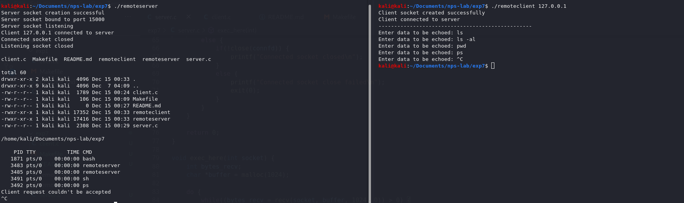
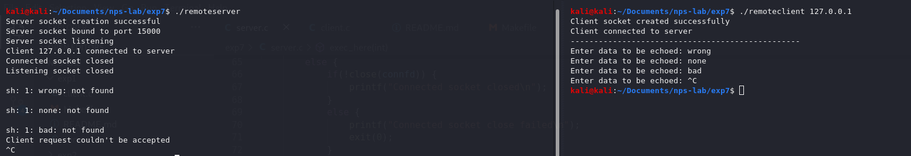

<!-- omit in toc -->
# Experiment 7
Implementation of remote command execution using socket system calls.

<!-- omit in toc -->
# Table of contents
- [Description](#description)
- [Initiation](#initiation)
  - [To build](#to-build)
  - [Start processes](#start-processes)
  - [To clean executables](#to-clean-executables)
- [Execution](#execution)
  - [Successful connection](#successful-connection)
  - [Failed connection - Bad command given](#failed-connection---bad-command-given)

# Description
- Basic client-server model.
- Server executes commands sent by client.
- Client asks for command to be executed, which is sent to the server to execute.
- Concurrent server, multiple clients can be opened and serviced at the same time.

# Initiation

## To build
```bash
make all
```

## Start processes
- Server
```bash
./remoteserver
```

- Client (on localhost)
```bash
./remoteclient 127.0.0.1
```

## To clean executables
```bash
make clean
```

# Execution

## Successful connection


## Failed connection - Bad command given
