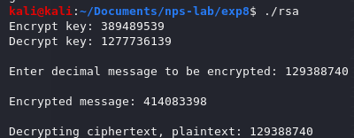

<!-- omit in toc -->
# Experiment 3
Write a program to encrypt and decrypt the data using RSA and exchange the key securely using Diffie-Hellman Key exchange protocol.

<!-- omit in toc -->
# Table of Contents
- [Description](#description)
- [Initiation](#initiation)
  - [To build](#to-build)
    - [All](#all)
    - [Diffie-Hellman](#diffie-hellman)
    - [RSA](#rsa)
  - [Start processes](#start-processes)
    - [Execute Diffie-Hellman](#execute-diffie-hellman)
    - [Execute RSA](#execute-rsa)
  - [To clean executables](#to-clean-executables)
    - [All executables](#all-executables)
    - [Diffie-Hellman](#diffie-hellman-1)
    - [RSA](#rsa-1)
- [Execution](#execution)
  - [RSA](#rsa-2)
    - [Successful execution 1](#successful-execution-1)
    - [Successful execution 2](#successful-execution-2)
  - [Diffie-Hellman](#diffie-hellman-2)
    - [Successful execution 1](#successful-execution-1-1)
    - [Successful execution 2](#successful-execution-2-1)

# Description
- Secret keys are generated via the Diffie-Hellman alogrithm based on random public keys generated by the two communicating parties.
- RSA algorithm is employed to both decrypt and encrypt an integer message after generating the public/private key pairs of both communicating parties.
- Both are mere simulations and proofs of the respective algorithm's workings; can be improved by implementing across networks.
- Both involve having pre-generated random numbers hard-coded in the codes; can be improved by randomly generating primes of larger sizes.

# Initiation

## To build

### All
```bash
make all
```

### Diffie-Hellman
```bash
make diffie
```

### RSA
```bash
make rsa
```

## Start processes

### Execute Diffie-Hellman
```bash
./dh
```

### Execute RSA
```bash
./rsa
```

## To clean executables

### All executables
```bash
make clean-all
```

### Diffie-Hellman
```bash
make clean-diffie
```

### RSA
```bash
make clean-rsa
```

# Execution

## RSA

### Successful execution 1


### Successful execution 2



## Diffie-Hellman

### Successful execution 1


### Successful execution 2
